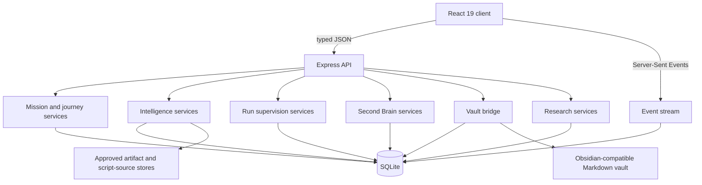

# Architecture

## Product boundary

Ti-Scale is a standalone local-first product. The browser client, API process, database, event stream, artifact paths, vault boundary, and test fixtures use dedicated namespaces and explicit configuration.

The product model is mission-centered:

- A **Mission** stores the durable objective, authorization scope, journey, targets, constraints, and success criteria.
- A **Run** is one attempt against a mission.
- A **Plan** is a versioned strategy made of bounded steps and dependencies.
- An **Action** represents a provider turn, tool call, delegated task, or operator decision.
- An **Event** is an append-only operational state change.
- **Evidence**, findings, and artifacts remain distinct records.
- A **Context Pack** records the small set of memory items retrieved and used for one purpose.

## Runtime topology

### Client

The client uses React, TypeScript, Vite, route-level feature modules, runtime schema validation, a query cache, and one normalized event-stream provider. The shell includes the mission portfolio, live operations, Guided workspace, decisions, intelligence, agents, Second Brain, learning, observability, reports, system controls, and an operator manual.

### API

The Express server mounts versioned routes under `/api/v2`. HTTP handlers validate requests, resolve an authenticated actor, call domain services, and return a consistent error envelope with a request ID. Business logic lives in services and repositories rather than route handlers.

### Database

SQLite is opened with:

- foreign keys enabled,
- WAL mode for writable file databases,
- a bounded busy timeout,
- prepared statements,
- integrity checks when an existing file is opened,
- file mode `0600` for a writable database.

Migrations are ordered and recorded. Events and audit records are append-only; materialized current-state tables serve interactive queries.

### Event delivery

State changes are paired with durable events and an outbox. The event service provides bounded in-process fanout, backpressure, replay, cursor-based gap repair, sensitivity filtering, and heartbeat comments. The client reconnects and reconciles from its last acknowledged position.

### Second Brain

Memory nodes and edges include scope, sensitivity, confidence, lifecycle, authorship, version, and provenance. Retrieval combines exact identifiers, lexical search, graph neighborhoods, recency, and policy filters. Every runtime retrieval creates a Context Pack, including a recorded `no relevant memory` result when appropriate.

### Vault bridge

The vault bridge projects eligible memory nodes to Markdown with YAML frontmatter and `[[wikilinks]]`. It uses a configured filesystem root, rejects traversal and symbolic-link escapes, writes atomically, hashes attachments, and records conflicts instead of overwriting concurrent edits.

## Execution adapter boundary

Planning, provider calls, specialist assignment, and tool execution are ports, not implicit capabilities of the HTTP process. The default server mounts a deterministic manual-only Guided planner whose execution port is deliberately unable to contact a target, provider, tool, or MCP server. It has no Autonomous or generic tool execution adapter. Its readiness projection reports those distinctions, and unavailable execution-dependent endpoints fail closed with a structured `503`.

An execution integration is acceptable only when it can provide fresh, typed readiness for:

- policy enforcement,
- provider authentication and callability,
- specialist capabilities,
- tool-server manifests,
- exact-step Guided authorization,
- cancellation and child cleanup,
- heartbeats, leases, checkpoints, and result attribution.

Read-only and record-management capabilities remain usable without representing the process as an autonomous executor.

## Trust boundaries

1. **Browser to API** — signed local session or bearer token; CSRF protection for cookie-authenticated mutations.
2. **API to database** — prepared statements and transaction boundaries.
3. **API to artifact store** — validated roots, canonical metadata, hashes, and sensitivity policy.
4. **Database to vault** — database remains canonical; projection is explicit and conflict-aware.
5. **Runtime to public providers** — minimized, sanitized typed envelopes with exposure receipts.
6. **Research worker to evaluator** — candidate strategy and evaluator are separate; the evaluator recomputes results locally.

## Availability model

Long-running domain work is not owned by an open HTTP request. Leases, heartbeats, checkpoints, budgets, retry categories, circuit breakers, and deterministic state transitions provide the recovery contract. Process startup verifies the database before mounting operational routes.
